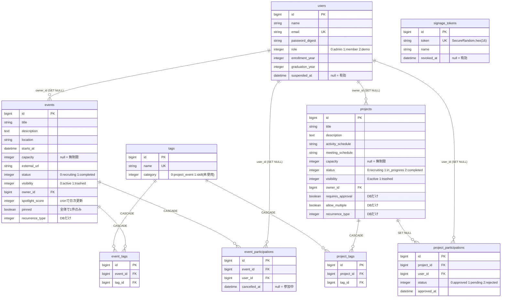

# ER図

`backend/db/schema.rb` から起こしたもの。定義の正は `spec-v2.2.md` §2。



`signage_tokens` はどのテーブルとも関連を持たない。端末を識別するだけで、
ユーザーとは結びつかないため（サイネージは「認証は通っているがユーザーではない」状態）。

## 説明が必要な設計判断

### ON DELETE を意図的に分けている

| 外部キー | 挙動 | 理由 |
|---|---|---|
| `event_participations.event_id` | **CASCADE** | イベントは単発で復旧の概念が薄く、参加履歴を残す価値が低い |
| `project_participations.project_id` | **SET NULL** | プロジェクトは論理削除後も参加者一覧を閲覧でき、復旧時にメンバーがそのまま戻る必要がある |
| `*.user_id`、`*.owner_id` | SET NULL | 退会しても企画と参加記録は残す |

この2つを取り違えると、プロジェクトを消したときにメンバーが失われる。

### 部分ユニークインデックスを2本使っている

```sql
-- ピン留めは全体で常に1件のみ
CREATE UNIQUE INDEX index_events_single_pinned
  ON events (pinned) WHERE pinned = true;

-- 二重参加を防ぐ。キャンセル済みは対象外なので再参加は可能
CREATE UNIQUE INDEX index_event_participations_active
  ON event_participations (event_id, user_id) WHERE cancelled_at IS NULL;
```

どちらも運用ルールをアプリの `if` 文ではなく**DB制約で表現**している。
アプリのバグでは破れない。実際、ピン留めの切り替えで順序を誤ったとき、
この制約が `PG::UniqueViolation` で弾いた。

`project_participations` は条件なしの単純な UNIQUE `(project_id, user_id)`。
プロジェクトにはキャンセルの概念が無いため、`event_participations` とは条件が違う。

### キャンセルを物理削除しない

`event_participations.cancelled_at` に時刻を入れる。
注目スコアの「直近3日の参加増加数」を正確に出すために、行が残っている必要がある。

### 意図的に作っていないもの

`profile_image` / `profile_text` / `is_active_override` /
`organizers` テーブル / `signage_tokens.last_accessed_at`。

（`suspended_at` は 2026-08-20 に追加した。`wireframe-admin-ver2.html` ② が
アカウント停止を要求したため。「必要になってから入れる」という基準どおりの
追加であり、基準を破ってはいない。`spec-v2.2.md` §0.4 参照）

判断基準は `spec-v2.2.md` §0.3 —
「後から追加したとき、既存の全行にデータを入れ直す必要があるか」。
必要なら今入れる（`role`、`graduation_year`）。nullable で空のまま成立するなら
必要になってから入れる。「将来使うかもしれない」は理由にならない。
